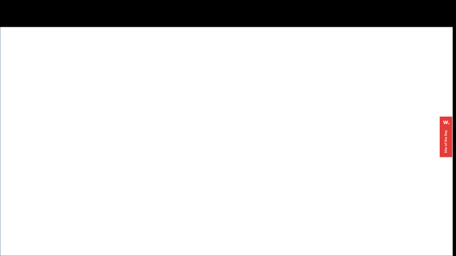

Mis disculpas por la omisión. Aquí tienes el README con los enlaces de los GIFs:

### Animation Repository

This repository contains a collection of animations created using GSAP (GreenSock Animation Platform), a powerful animation library in JavaScript. GSAP allows for creating smooth and complex animations with ease, offering great control over timing, sequencing, and interactivity of animations.

#### Description

In this repository, you will find a variety of animations designed for use in web projects. From simple animations to more complex effects, these animations can be used to enhance the user experience in your web applications, websites, or front-end development projects.

#### Examples of Animations

Below are some examples of the animations included in this repository:

1. **SVG Animations**: An animation that smoothly and gradually makes svg appear.

2. **Typing text animation**: An animation that simulates a typing text.

3. **Simple transition**: An animation that smoothens the transition between different pages or sections of a website.

4. **100 Century**: A complex animation.

#### Usage of GSAP

This project utilizes GSAP to create all included animations. GSAP provides a simple yet powerful syntax for creating animations in JavaScript, allowing precise control over duration, delay, execution order, and other aspects of animations.

For more information about GSAP, visit [the official GSAP website](https://greensock.com/gsap/).

#### Contributing

Feel free to contribute your own animations or improve existing ones! Simply fork the repository, make your changes, and submit a pull request. We look forward to seeing your amazing animations!
